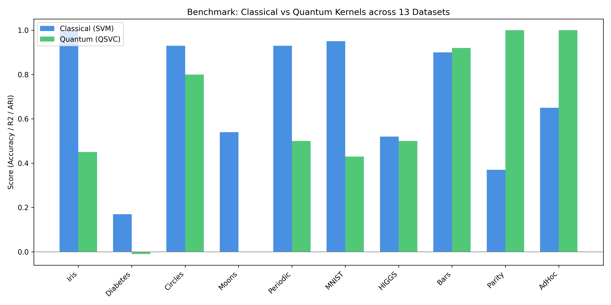
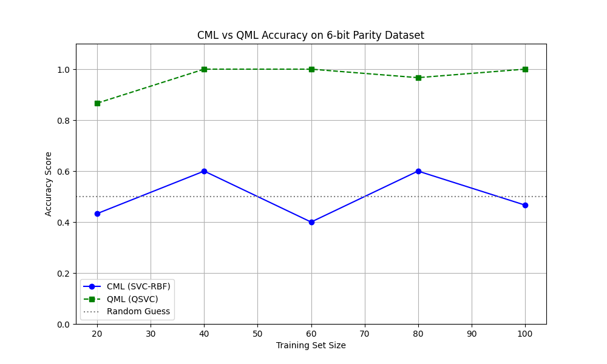
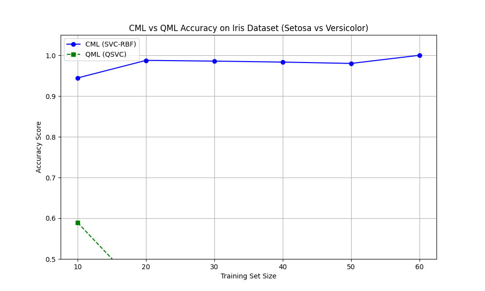
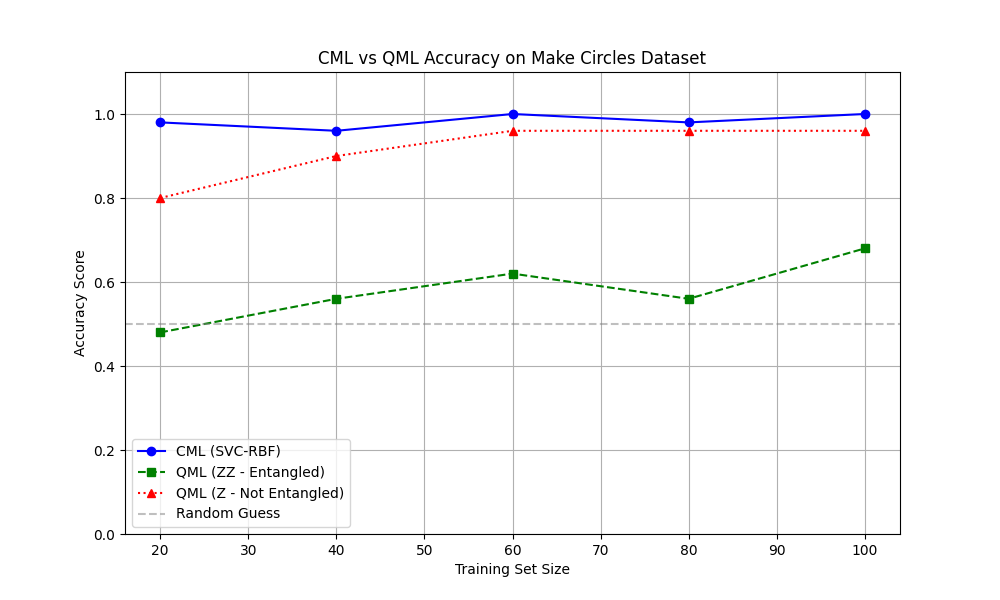
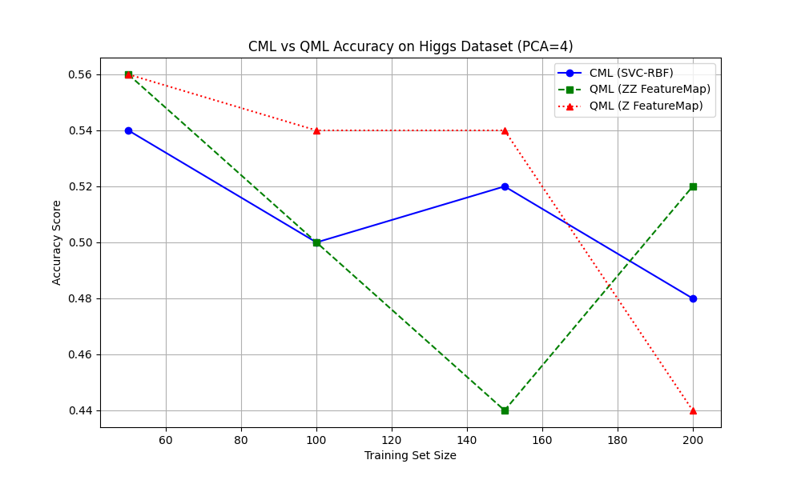

# Quantum-Vs-Classical-ML-Analysis
# Quantum vs. Classical: A Comparative Benchmark of Kernel Methods


> **Abstract:** A comprehensive study benchmarking Quantum Machine Learning (QML) against Classical Machine Learning (CML) across 13 diverse datasets. This project identifies the specific "structural niche" where quantum kernels outperform classical RBF kernels.

## Executive Summary & Key Results

We tested **13 datasets** ranging from standard tabular data (Iris, Diabetes) to synthetic quantum-native problems (AdHoc, Parity).

**The Verdict:** QML is not a universal accelerator. It dominates in domains requiring **global, non-local logic** (entanglement) but fails to beat classical optimization on standard geometric clusters.




### Benchmark Table (Top 10 Datasets)

| Dataset | Task | CML Score (SVM) | QML Score (QSVC) | Outcome |
| :--- | :--- | :--- | :--- | :--- |
| **Iris (Simplified)** | Classification | **1.00** | 0.45 | CML Wins |
| **Diabetes (PCA)** | Regression ($R^2$) | **0.17** | -0.012 | CML Wins |
| **Make Circles** | Non-Linear | **0.93** | 0.80 | CML Wins |
| **Moons** | Clustering | **0.54** (ARI) | -0.004 | CML Wins |
| **MNIST (3 vs 8)** | Image Rec. | **0.95** | 0.43 | CML Wins |
| **HIGGS (PCA)** | Physics | **0.52** | 0.50 | CML Wins |
| **Bars & Stripes** | Pattern Rec. | 0.90 | **0.92** | **QML Slight Edge** |
| **6-bit Parity** | Logical XOR | 0.37 | **1.00** | **QML Dominates** |
| **AdHoc** | Synthetic | 0.65 | **1.00** | **QML Dominates** |

---

## Methodology

[cite_start]The core objective was to compare the **Radial Basis Function (RBF)** kernel against the **Fidelity Quantum Kernel**[cite: 72, 78].

### 1. Classical Approach (Baseline)
* **Algorithm:** Support Vector Classifier (SVC) / SVR.
* **Implementation:** `scikit-learn`.
* [cite_start]**Mechanism:** Maps data to infinite-dimensional space using the RBF kernel to find a separating hyperplane [cite: 69-72].

### 2. Quantum Approach (Proposed)
* **Algorithm:** Quantum SVC / QSVR.
* **Implementation:** `qiskit-machine-learning`.
* **Mechanism:** Maps data into a high-dimensional Hilbert space using a parameterized quantum circuit. [cite_start]The kernel is calculated via the "kernel trick" (Fidelity test) [cite: 75-79].
* **Feature Maps (Encodings) Used:**
    * [cite_start]`ZFeatureMap`: For simple geometric data (linear, no entanglement)[cite: 107].
    * [cite_start]`ZZFeatureMap`: For logic problems (creates pairwise entanglement)[cite: 107].
    * [cite_start]`PauliFeatureMap`: For complex correlation testing[cite: 109].

---

## Result Overview

Our results highlight two critical insights regarding the utility of QML:

### 1. The Parity Problem (XOR)
The **6-bit Parity** dataset represents a problem where the output depends on the global correlation of all inputs (XOR logic).
* [cite_start]**Classical Failure:** Standard RBF kernels struggle to capture this dependency (Accuracy: ~37%)[cite: 211].
* [cite_start]**Quantum Success:** Using the `ZZFeatureMap` with entanglement, the quantum kernel naturally maps these correlations, achieving **100% accuracy**[cite: 107, 211].

### 2. The "Simulation Barrier"
While QML showed accuracy gains in specific niches, the computational cost on a classical simulator was immense. [cite_start]We observed an approximate **10,000x slowdown** due to the exponential cost ($2^n$) of simulating entanglement[cite: 320]. This confirms QML is designed for real QPUs, not simulators.

## Case Study
### 1. The "Quantum Win" (6-bit Parity)
The Parity problem requires global entanglement, which the classical kernel fails to capture.


### 2. The "Classical Win" (Iris Dataset)
For simple geometric clusters, the quantum kernel adds unnecessary noise.


<details>
<summary><strong> Click to see results for other datasets (Higgs, Circles, Moons)</strong></summary>

### Make Circles (Non-Linear)


### HIGGS Boson (Physics Data)


### Moons (Clustering)


</details>

---

## Repository Structure

```text
├── experiments/            # Python scripts for each dataset
│   ├── adhoc_qml.py
│   ├── parity_qml.py
│   ├── iris_qml.py
│   └── ...
├── results/                # Generated plots and logs
├── visual.py               # Represents Dataset as plotted points
├── benchmark_summary.png   # Chart showing the results obtained
├── requirements.txt        # Project dependencies
└── README.md
